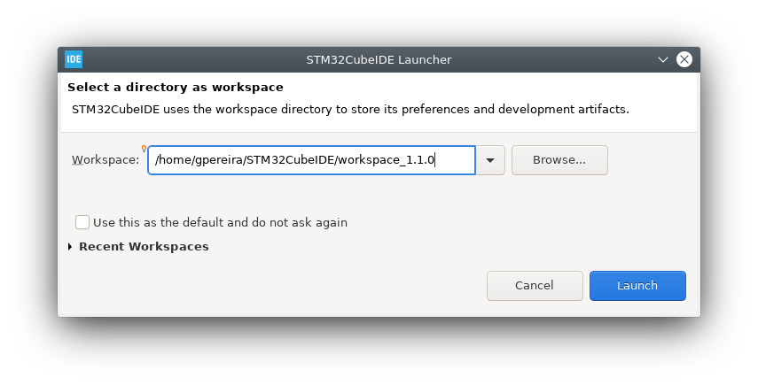
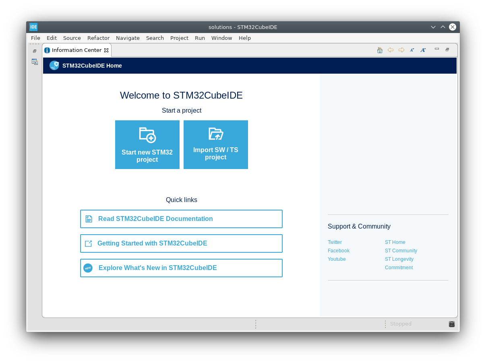
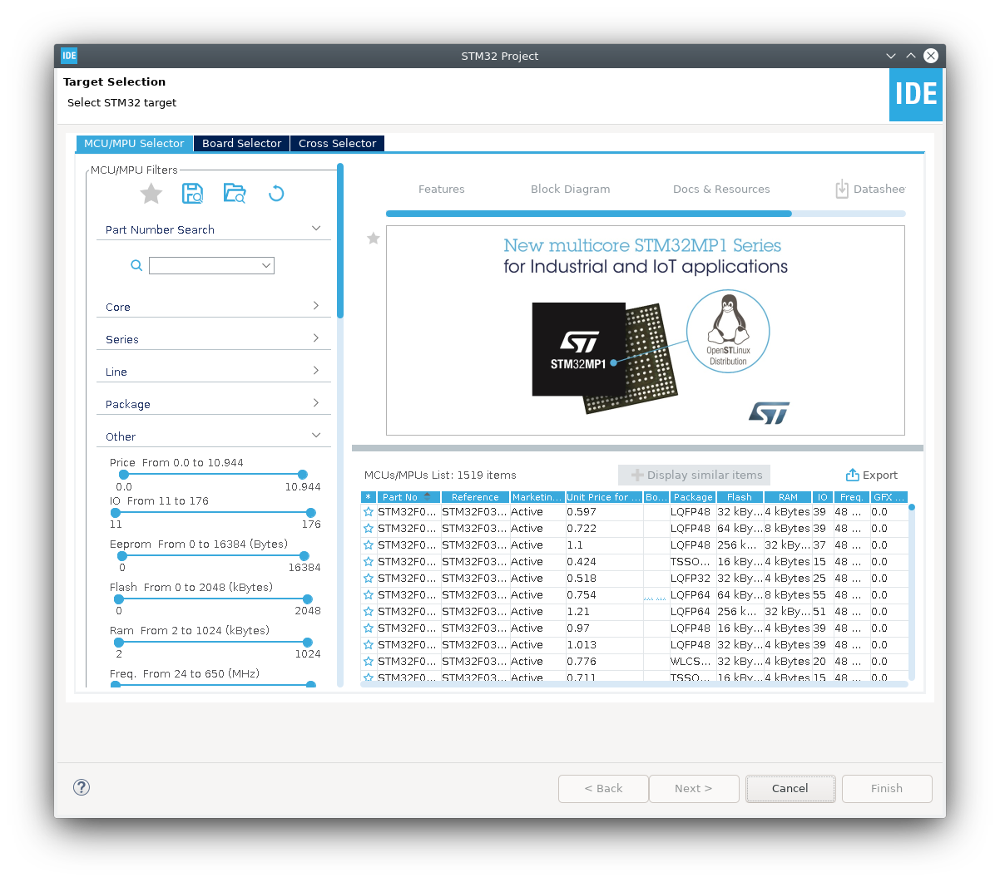
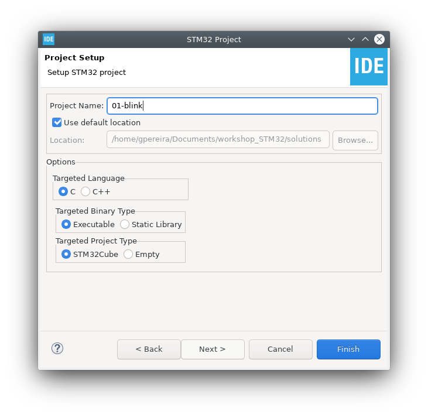
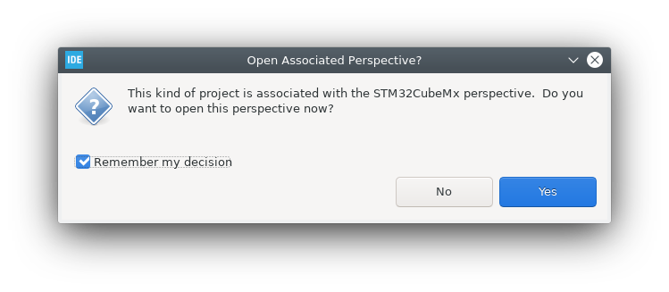
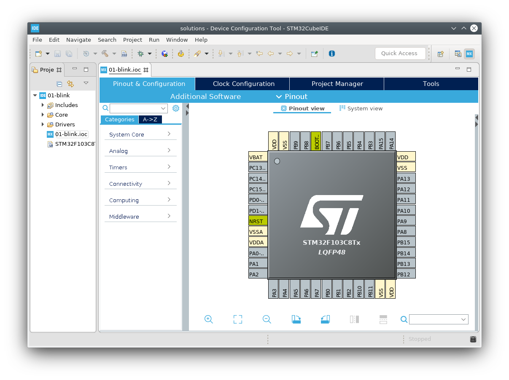
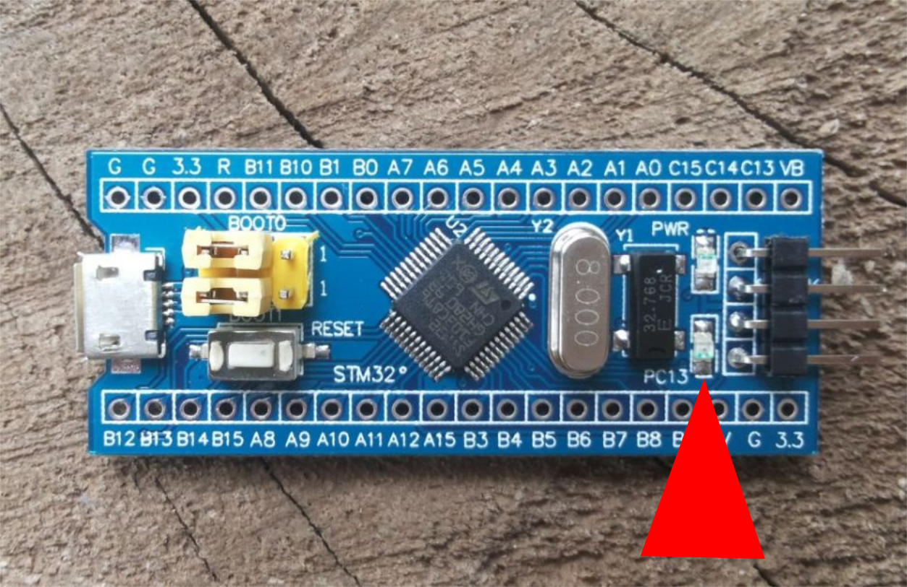
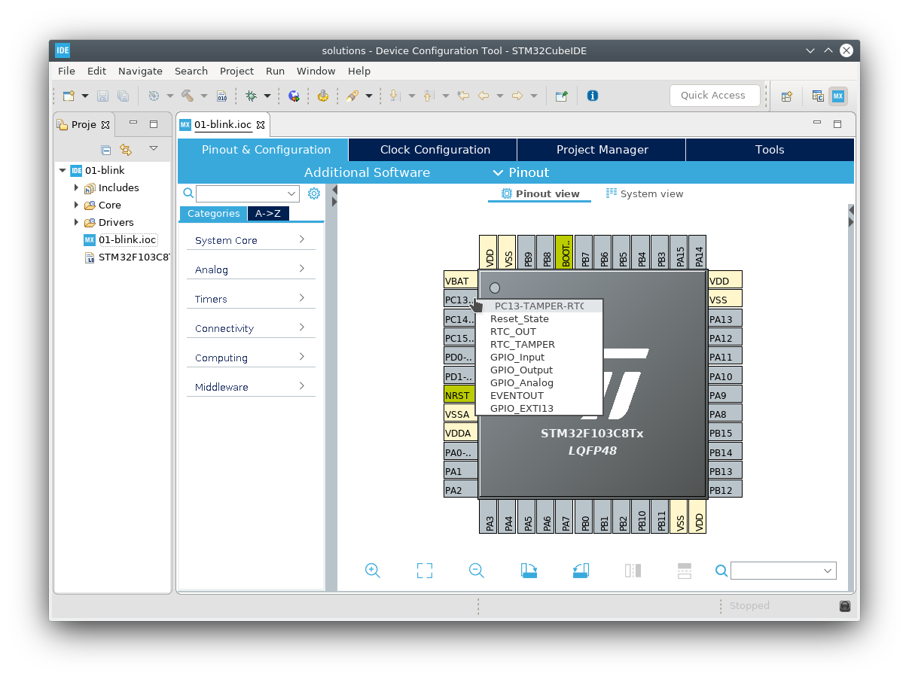
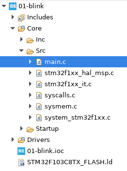

# Meet STM32CubeIDE
## Get it to blink

If you have a software programming background you are used to do a **Hello World** code as your first program to test your setup. When it comes to hardware it's more common to make a LED blink. But remember... you are a free and independent human being so you get to choose the speed the LED should blink, but don't make it too fast, we want to seize the moment and be able to actually see it blink!

Let's go, open up STM32CubeIDE if you haven't already, and you should be greeted with the folllowing window:

This **workspace** is where your projects will be stored, you can see a workspace as a group of projects. For example, it is a good idea to have a workspace for all the projects of this workshop.

Then the welcome page will show up:

Click on **Start new STM32 project** and you will be preseted with a powerfull tool to help you pick the microcontroller you need.

You can filter by the number of pins you need, number of SPI, UART, a lot of other interfaces and hardware features. In this case we have already done this for you and we gave you a **STM32F103C8**. You can search for it on the search bar on the upper left and click **Next**.

Then you can give the project a name and click **Finish**.

It will ask you if you want to open STM32CubeMx perspective, it is recommended that you check **Remember my decision** and then click **Yes** to see the STM32F103C8 in all its glory.

If all went ok you will see this screen:

This is were you do all the peripheral configurations, you can do it in the code but here you can see all the options check if your configurations are ok.
Here you can for example turn an analog pin on and set its sampling time, for example, if you have two analog signals you can configure to sample the first signal 10 times per second and the second one 2 times per second. This lets you give priorities to the analog signals you have. Impressed?! This only scratches the surface of what you can do with this microcontroller!

Now let's learn to walk before we can run. Let's try to make the LED already included in the STM32 blink.
As you an see in the board the LED has the following marking **PC13** next to it.

This means it is connected to pin PC13 of the microcontroller, so you should set this pin as an output pin. You can do that by left clicking the **PC13** pin and select **GPIO_Output**.

Then hit save and say **Yes** when you are propmted to generate code. Like before, we recommend checking **Remember my decision**.

Then on the left open the main.c file that can be found at:

Whoaaa! there's a lot going on here already! Yes, STM32CubeMX, the tool you selected the pin as output, generates (the boring to write) code for you and because of that you need to be careful were you write your own code because there is chucks of code that belong to STM32CubeMX and those chunks are overwrited each time you change anything in STM32CubeMX. This means you have be be extra careful to always write your code between **BEGIN** and **END** comment statements. If you do that your code will stay safe. Here it is an excerpt of code that has two bounding boxes for you to write code. Each one has different titles, for different ends.

~~~~c
#include "main.h"

/* Private includes ----------------------------------------------------------*/
/* USER CODE BEGIN Includes */

/* USER CODE END Includes */

/* Private typedef -----------------------------------------------------------*/
/* USER CODE BEGIN PTD */

/* USER CODE END PTD */
~~~~

Hmmm, ok, but what code was generated when you have set **PC13** as output? Let's see.

~~~~c
static void MX_GPIO_Init(void)
{
  GPIO_InitTypeDef GPIO_InitStruct = {0};

  /* GPIO Ports Clock Enable */
  __HAL_RCC_GPIOC_CLK_ENABLE();

  /*Configure GPIO pin Output Level */
  HAL_GPIO_WritePin(GPIOC, GPIO_PIN_13, GPIO_PIN_RESET);

  /*Configure GPIO pin : PC13 */
  GPIO_InitStruct.Pin = GPIO_PIN_13;
  GPIO_InitStruct.Mode = GPIO_MODE_OUTPUT_PP;
  GPIO_InitStruct.Pull = GPIO_NOPULL;
  GPIO_InitStruct.Speed = GPIO_SPEED_FREQ_LOW;
  HAL_GPIO_Init(GPIOC, &GPIO_InitStruct);

}
~~~~
Even a simple IO pin has some configurations to be done. It can be seen that the default state for the LED is OFF because its state was set to _GPIO_PIN_RESET_. Other interesting thing to note is that you can set an internal pull-up or pull-down by setting `GPIO_InitStruct.Pull` to _GPIO_PULLUP_ or _GPIO_PULLDOWN_. You can also configure the GPIO to be push-pull or an open-drain by setting `GPIO_InitStruct.Mode`.

Here it comes the part we've all waiting for, let's make the LED blink! Search for the `while (1)` instruction and then use the same function present in the initialization routine to blink the LED. Be sure to put your code between **BEGIN** and **END** statements otherwise it will be thrown away later on.

**Tip:** You can use the `HAL_Delay(uint32_t Delay)` function to wait for a given time in milliseconds. And use **CTRL + SPACE** to complete code.

[Main Menu](../README.md) | [Next](ex2-pwm.md)