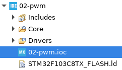
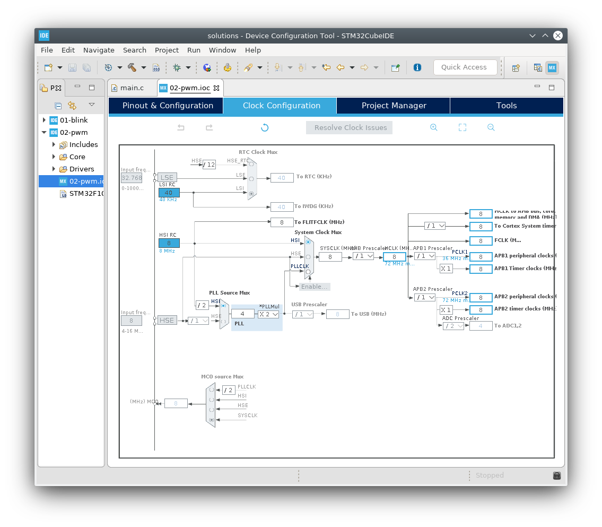

# Tick-Tack

## Clocks, Timers and Pulse With Modulation (PWM)

Don't you think that it's kind of annoying the LED blink so abruptly? Let's make the make the LED fade between ON and OFF. This time we'll use the external LED that you have already connected in your setup.

Follow the same procedure to create a new project.

Clocks, as you can expect, can be used to count time or set the pace for some circuit. The STM32, like many other ARM microcontrollers, give you a lot of clock configurations. You can access this configurations by opening STM32CubeMX again by clicking on the **.ioc** file in the left hand side.

And then click on **Clock Configuration**

Here you can see and configure every clock speed that goes to each specific preipheral and select the clock source.

Go kid! Go play a little, when your done I will be here waiting for you when you want to carry on!

Now, do you know what PWM is? Well it consists in using a timer that counts time and when the counter is above a certain number, defined by the _duty-cycle_, the pin changes polarity.

Since this pattern repeats itself at high frequencies, it can rougly act as a analog signal so we can use it to supply the LED with various voltage levels between 0V and 3.3V.

For this you'll have to configure the Timer 1 Channel 1 in PWM Generation mode in order to configure **PA8** as the output PWM pin. And configure the timer period, this is a 16 bit timer so you can set a number between 0 and 65535 (2^16). In this case the period will dictate your resolution, for example, if you set 4 for the period, you will only get 5 possible duty-cycles 0%, 25%, 50%, 75%, 100% and this will not make the LED fade smoothly.

Now go to the code and figure out how can you make the LED fade ON and OFF.

**Tip:** You can use `TIM1->CCR1` to set the dutty-cycle

[Main Menu](../README.md)
