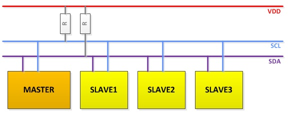

# Communication Buses

## SPI and I2C

You probabily know this protocols, they are common among microcontrollers. They are faster than UART and are handy when dealing with a lot of sensors, because you can use the same bus for multiple devices.

# Exercise

This time we will throw you to the wolves for you to learn a bit more for yourself.

We have some sensors at your disposal that you can use. We propose you look at the sensor datasheet and read and write in its SPI or I2C registers in order to configure and read its measurements.
Ask us which sensors are available!

BME280 example code: https://github.com/LonelyWolf/stm32/blob/master/bme280/bme280.c

[Main Menu](../README.md) | [Next](ex4-sdcard.md)