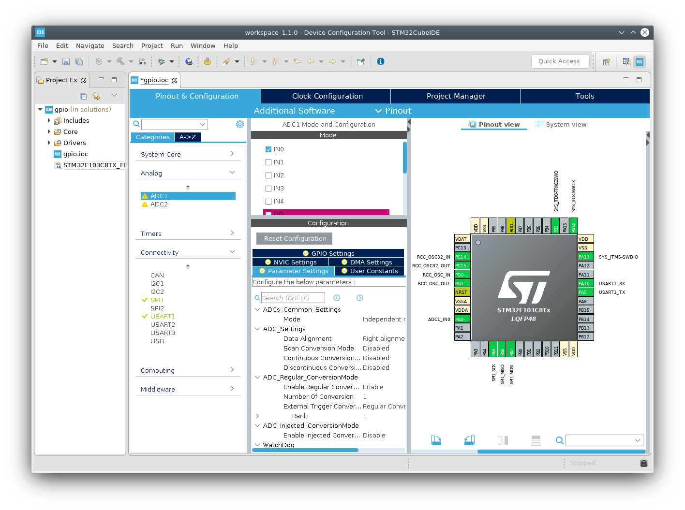

# Setup Workspace

Like in every hands-on workshop this part can be arsh and different for everyone. It's a good sign, it means that your parents were right, you are special afterall! Well, enough of yatta yatta, let's get to it!

## STM32CubeIDE

Based on [Eclipse](https://www.eclipse.org/) this software let's you program the STM32 and help you with some initial and otherwise repetitive configurations. You can for example graphically set inputs and outputs or turn on SPI and the initialization code is generated automatically.

To install you can go to STMicroelectronics webpage by clicking [here](https://www.st.com/en/development-tools/stm32cubeide.html). Follow the installation steps, described [here](../docs/en.DM00603964.pdf) and if you have problems or doubts feel free to ask.

[Main Menu](../README.md) | [Next](ide.md)